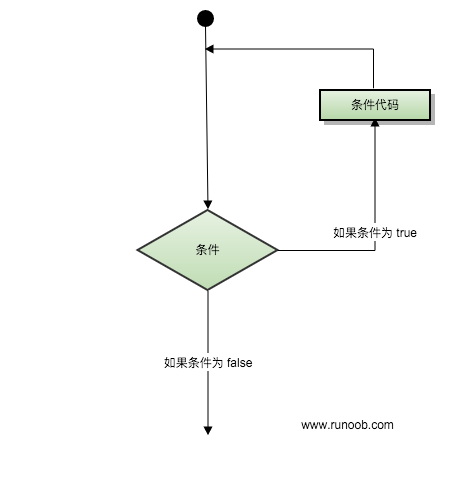
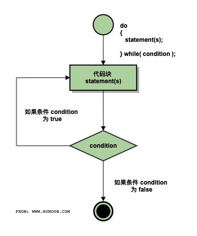

---

title: C语言快速入门
date: 2020-10-22 14:05:38
tags: C语言
---

# 序言

C语言是一种面向过程的计算机编程语言，多用于嵌入式开发（电路硬件编程）与系统底层编写，比如我们常用的Linux系统，Windows系统就是主要由C语言编写的。同时c语言也是最早出现的编程语言之一，最早在1972年就已经被使用，并且直到现在它也是使用率最多的编程语言之一。

### 计算机的内存

代码本身存储在计算机的硬盘里，不管计算机开机还是关机，你写的程序的代码都是存在的，但是一个程序要想运行起来就需要运行在计算机的内存里。

可以将计算机的内存想象成一个大的空间，这个空间中有各种各样的程序在运行着，并且每个程序都会占用一定的空间，而所占空间的大小由程序本身所有的一些变量，函数等决定。

### 计算机基本快捷键的使用

1. ctrl+空格 / ctrl+shift : 快速切换中英文输入法
2. Ctrl-X：剪切所选项并拷贝到剪贴板。
3. Ctrl-C：将所选项拷贝到剪贴板。
4. Ctrl-V：将剪贴板的内容粘贴到当前文稿或应用中。 
5. Ctrl-Z：撤销上一个命令。 
6. Ctrl-A：全选各项。
7. Ctrl-S:   保存当前文件
8. Ctrl-F：查找文稿中的项目或打开“查找”窗口。
9. win+R:  唤起“运行”对话框，快速运行特定程序
10. win+X:  唤起系统菜单

### 什么是编译器

我们的计算机只能够识别由0和1的二进制码，因此我们写出来的代码要想运行起来必须经过软件的编译，将英文的编程语句转换为电脑能够识别的二进制码，不论哪种编程语言，最终都会经过编译转换为计算机可识别的二进制码。**将代码转换为二进制机器码的过程就叫做编译，负责进行转换的程序叫做编译器**。例如 gcc编译器 等

### IDE(集成开发环境)是什么

 IDE 是 Intergreated Development Environment 的缩写，中文称为集成开发环境，是指辅助程序员开发的应用软件。

我们已经知道，想要运行一个C语言程序必须有编译器，但是在实际开发过程中，除运行程序必须的编译器之外，我们往往还需要很多其他的辅助工具，比如 语言编辑器、自动建立工具、除错器等等 。这些被打包在一起成为一个开发软件， 统一发布和安装，统称为集成开发环境（IDE）。比如我们使用的VS2010，devc++，CLion等都是IDE。

#### IDE与编译器的区别

IDE是编译器与其它各种开发工具的集合体

### 面向过程思想

 面向过程是一种以**过程**为中心的编程思想，其原理就是将问题分解成一个一个详细的步骤，然后通过函数实现每一个步骤，并依次调用。
         面向过程我们所关心的是解决一个问题的步骤，举个例子，汽车发动、汽车熄火，这是两个不同的事件，对于面向过程而言，我们关心的是事件本身，因此我们会使用两个函数完成以上两个动作，然后依次调用即可。 

再比如 进入游戏，开始游戏，游戏结算，这是三个不同的事件，我们在玩游戏时只会关注这三个事件，我们可以使用函数来表示这三个不同的动作，依次调用。

### 第一个程序（Hello World!)

```c
#include <stdio.h>
 
int main()
{
    /* 我的第一个 C 程序 */ 
    printf("Hello, World! \n");
    return 0; 
}
```


#### 程序解析

一个最基础的C语言程序由 **预处理器指令，函数，变量，语句和表达式 以及 注释**组成

接下来我们讲解一下上面这段程序：

1. 程序的第一行 **#include ** 是预处理器指令，告诉 C 编译器在实际编译之前要包含**stdio.h**文件，可以将头文件理解为一个工具箱，在我们开始工作前，需要先拿好工具箱才能开始我们的工作。
2. 下一行**int main()** 是主函数，程序从这里开始执行。
3. 下一行 /\*...\*/ 将会被编译器忽略，不会执行，这里放置程序的注释内容。它们用来告诉读者这个程序或者这些代码要做什么。
4. 下一行 **printf(...)**是 C 中另一个可用的函数，会在屏幕上显示消息 "Hello, World!"。
5. 下一行 **return 0;** 终止 main() 函数，并返回值 0，表示程序完整地结束。

# 基本语法

**分号**：在c语言中，每个语句之后必须跟一个 **英文分号**表示一个语句的结束

**注释**：C语言有两种注释方式，分别是 **//**和**/\*….\*/**,//是单行注释，只会将一行标注为注释，而**/*\..\*/**是多行注释,在/\*到*/之间的内容都会被标为注释。

```c
// 单行注释 //


/* 
 多行注释
 多行注释
 多行注释
 */
```

**标识符**:

C 标识符是用来标识变量、函数，或任何其他用户自定义项目的名称。一个标识符以字母 A-Z 或 a-z 或下划线 _ 开始，后跟零个或多个字母、下划线和数字（0-9）（并且一般情况下只能由这些字符组成）。

C 标识符内不允许出现标点字符，比如 @、$ 和 %。C 是**区分大小写**的编程语言。因此，在 C 中，*Manpower* 和 *manpower* 是两个不同的标识符。

# 数据类型

## 基本类型

### int（整型）

可以用来声明一个整数变量，例如

```c
int age = 20201022;
int year = 2020;
int num = 5;
```

### short（短字节类型）

可以用来声明短整形（节约内存），例如：

```c
short a = 0;
short b = 2;
```

### long int（长字节类型）

当数据的大小超出int类型的上限时，可以使用long int 甚至是long long int来扩大取值范围

例如：

```c
long long int num = 1234567890;
```

### double和float（浮点类型）

double和float用来表示浮点数（小数）

例如：

```c
double weight = 188.5326;
float high = 100.25;
```

区别：

double可以存储到小数点后15位，float可以存储到小数点后6位

### char（字符类型）

char是最小的基本类型，只占1个字节的存储空间，主要用来表示字符，例如‘a’,‘b’,‘c’,‘d’等。

值得注意的是，**char类型的‘1’和int类型的1是不一样的**，在实际编写代码时需要注意。

### unsigned（无符号）修饰符

 unsigned可以用来修饰前面的数据类型，例如unsigned int,unsigned char,unsigned double等，被unsigned修饰的数据类型其所占的存储空间大小不变，但是最大值会扩大为原来的2倍，最小值变为0.也就是说，一个数据类型被unsigned修饰以后，这个数据类型将变为无符号类型，也就是其不再有负数值。

```c
unsigned short int a = 32767,b = a+1;//定义短整型无符号
printf("a = %u \n b = %u \n",a,b);//以无符号输出
```

**相对于unsigned，还有一个signed修饰符，signed是有符号修饰符，但是我们一般省略他，c语言默认的数据类型都是有符号的**

**注：int类型在16位系统中占2个字节，在32和64位系统中占4个字节**

#### 基本类型转换

1. **自动类型转换**

当两个不同类型的变量进行运算时，编译器会自动进行类型转换，自动类型转换遵从以下规则：

  

例如：

```c
int a = 1;
double b = 1.2;
double c = a+b;
printf("%f",c); // c = 2.200000
```

在执行a+b运算的时候编译器会先把int类型的a转为double类型，然后再和b进行运算

2. **强制类型转换**

   ```c
   double a = 3.641593;
   printf("%d\n",(int)a ); // 3
   printf("%lf\n",a );// 3.641593
   ```

   > **注：在进行由高到低的强制类型转换时，数据会有部分丢失**
   >
   > **强制类型转换是临时的，不会修改变量本来的类型**

## 基本类型书写

**整数**

-  默认为10进制 ，10 ，20。
-  以0开头为8进制，012，024。
-  以0b开头为2进制，0b1010, 0b10100。
-  以0x开头为16进制，0xa，0x14。

**小数**

单精度常量（float）：2.3f 。

双精度常量（double）：2.3，默认为双精度。

**字符型常量**

用英文单引号括起来，只保存一个字符，'a'、'b' 、'*' ，还有转义字符 '\n' 、'\t'。

**字符串常量**

用英文的双引号引起来 可以保存多个字符,比如："唐梓捷"。

### 变量

 变量其实只不过是程序可操作的存储区的名称。C 中每个变量都有特定的类型，类型决定了变量存储的大小和布局，该范围内的值都可以存储在内存中，运算符可应用于变量上。 例如

```c
int age = 5;
```

这里的age就是一个变量，变量age的值为5，而”age“叫做变量名。

同一类型的多个变量的声明之间可以用逗号隔开

```c
int    i, j, k;
//声明并定义了变量 i、j 和 k，
//这指示编译器创建类型为 int 的名为 i、j、k 的变量。下面同理
char   c, ch;
float  f, salary;
double d;
```

#### 变量的输入和输出

1. scanf：

   输入char变量：

   ```c
   char a;
   scanf("%c",&a);
   ```

   输入int变量：

   ```c
   int a = 50;
   scanf("%d",&a);
   ```

   输入double/float变量：

   ```c
   double a;
   scanf("%lf",&a); 
   ```

   ```c
   float a;
   scanf("%f",&a); 
   ```

2. printf：

   输出char变量：

   ```c
   char a = 'c';
   printf("%c",a); // c
   ```

   输出int变量：

   ```c
   int a = 50;
   printf("%d",a); // 50
   ```

   输出double/float变量：

   ```c
   double a = 3.14;
   printf("%f",a); // 3.140000 默认保留六位小数
   printf("%.2f",a);// 3.14
   printf("%.1f",a);// 3.1
   ```

   | 符 号 | 类 型        | 说 明                 | 示 例                      | 结 果   |
   | ----- | ------------ | --------------------- | -------------------------- | ------- |
   | x     | unsigned int | 以十六进制小写输出    | printf("%x",11);           | b       |
   | X     | unsigned int | 以十六制大写输出      | printf("%X",11);           | B       |
   | o     | unsigned int | 以八进制无符号整S输出 | printf( "%o”,100);         | 144     |
   | u     | unsigned int | 以无符号整型输出      | printf( "%u,%u",100u,100); | 100,100 |
   | d、i  | int          | 以整型输出            | printf("%i,%d", 100,100);  | 100,100 |

### 常量

常量是固定值，在程序执行期间不会改变。

常量可以是任何的基本数据类型，比如int,double,char

#### 常量的定义：

1. 使用 **#define** 预处理器。

2. 使用 **const** 关键字。

   **被const和define修饰的变量不可变**

##### #define 预处理器

下面是使用 #define 预处理器定义常量的形式：

注意：define定义之后不需要加分号

```c
#include <stdio.h>
//模式：
//#define identifier value
//例子：
#define PI 3.1415926
#define R 5
#define LENGTH 10
#define WIDTH 5
#define NEWLINE '\n'

int main()
{
	int area;
	area = LENGTH * WIDTH;
	printf("value of area : %d\n", area);
	double r_area;
	r_area = PI * R * R;
	printf("value of double area:%lf\n", r_area);
	printf("%c", NEWLINE);
	return 0;
}
```

##### const 关键字

可以使用 **const** 前缀声明指定类型的常量，如下所示：

```c
#include <stdio.h>
 
int main()
{
   const int  LENGTH = 10;
   const int  WIDTH  = 5;
   const char NEWLINE = '\n';
   int area;  
   area = LENGTH * WIDTH;
   printf("value of area : %d", area);
   printf("%c", NEWLINE);
   return 0;
}
```


# 运算符

### 算术运算符

1. ”+“运算符：把两个数相加

   ```c
   int a = 2;
   int b = 5;
   int c = a + b;
   printf("%d",c); // c = 7
   ```

2. ”-“运算符：把两个数相减

   ```c
   int a = 2;
   int b = 5;
   int c = a - b;
   printf("%d",c); // c = -3
   ```

3. “*”运算符：把两个数相乘

   ```c
   int a = 2;
   int b = 5;
   int c = a * b;
   printf("%d",c); // c = 10
   ```

4. “/”运算符:把两个数相除，左边是被除数，右边的是除数（右边的数不能为0）：

   ```c
   int a = 2;
   int b = 5;
   int c = a / b;
   printf("%d",c); // c = 0
   /*这里因为a，b，c都是int类型，a/b=0.4,所以会直接舍去后面的.4，只剩0*/
   double d = 2.0;
   double e = 3.0;
   double f = e / d;
   //double类型允许小数的存在，因此这里的f就是1.5了
   ```

   注意：C语言**不会对计算结果进行四舍五入**，会**直接全部舍去**，比如3.9，转为int类型的时候就会变成3

5. ”%“：取余运算符，可以直接取整除之后的余数：

   ```c
   int a = 2;
   int b = 5;
   int c = b % a;
   printf("%d",c); // c = 1
   ```
   
6. ”++“运算符：自增运算符，让变量的值加1：

   ```c
   int a = 2;
   int c = a++;//也可以写成 c = ++a;
   printf("%d",c); // c = 3
   ```

   **a++与++a的区别**:

   在进行a++运算时，程序会先对a复制一次，然后让其+1，执行的操作类似 a = a + 1

   在进行++a运算时，程序会直接让a+1

   ```c
   int a = 0;
   printf("%d\n",++a);//输出1
   
   int b = 0;
   printf("%d\n",b++);//输出0
   printf("%d\n",b);//输出1
   ```

7. “--”运算符：自减运算符，让变量的值-1：

   与++运算符同理，a--运算会对a先复制一次，再让其-1，--a会直接让其-1

   ```c
   int a = 1;
   printf("%d\n",--a);//输出0
   
   int b = 1;
   printf("%d\n",b--);//输出1
   printf("%d\n",b);//输出0
   ```

### 关系运算符

> 真假值：在c语言中数字1代表真，0代表假

1. ==运算符：

   在c语言中 ”  =  “表示的是对一个变量进行赋值，而要想判断两个变量的值是否相同所用到的是    ” ==  “运算符，该运算符返回的是一个真假值（在c语言中1表示真值，0表示假值）。

   ```c
   int a = 5,b = 5;
   printf("%d",a == b);// 1
   a = 6;
   printf("%d",a == b); // 0
   ```

2. !=运算符:

   这个运算符表示两个变量是否不同，返回值为真假值：

   ```c
   int a = 5,b = 5;
   printf("%d",a != b);// 0
   a = 6;
   printf("%d",a != b); // 1
   ```

3. \>运算符：

   判断运算符左边的变量是否大于右边的变量：

   ```c
   int a = 5,b = 5;
   printf("%d",a > b);// 0
   a = 6;
   printf("%d",a > b); // 1
   ```

4. \<运算符：

   判断运算符左边的变量是否小于右边的变量：

   ```c
   int a = 4,b = 5;
   printf("%d",a < b);// 1
   a = 6;
   printf("%d",a < b); // 0
   ```

5. \>=运算符：

   判断运算符左边的变量是否大于等于右边的变量：

   ```c
   int a = 5,b = 5;
   printf("%d",a >= b);// 1
   a = 6;
   printf("%d",a >= b); // 1
   ```

6. \<=运算符：

   判断运算符左边的变量是否小于等于右边的变量：

   ```c
   int a = 4,b = 5;
   printf("%d",a < b);// 1
   a = 6;
   printf("%d",a < b); // 0
   ```

### 逻辑运算符

1. && 运算符：表示“且”，如果左右两个操作全部为真，则该表达式返回真

   ```c
   int a = 2,b = 3;
   (a < b && a == 2) // 这个表达式为 1
   (a < b && a == 3) // 这个表达式为 0
   (a < b && a == 3) // 这个表达式为 0
   (a > b && a == 2) // 这个表达式为 0
   ```

2. || 运算符： 表示“或”，左右两个操作有一个为真，则该表达式为真

   ```c
   int a = 2,b = 3;
   (a < b || a == 2) // 这个表达式为 1
   (a < b || a == 3) // 这个表达式为 1
   (a > b || a == 2) // 这个表达式为 1
   (a > b || a == 3) // 这个表达式为 0
   ```

3. ! 运算符： 表示“非”，如果修饰的条件表达式为真，则该表达式为假，反之为真。

   ```c
   int a = 2,b = 3;
   (a < b || a == 2) // 这个表达式为 1
   !(a < b || a == 2) // 这个表达式为 0
   (a > b && a == 2) // 这个表达式为 0  
   !(a > b && a == 2) // 这个表达式为 1  
   ```


### 赋值运算符

| 运算符 | 描述                                                         | 实例                            |
| ------ | ------------------------------------------------------------ | ------------------------------- |
| =      | 简单的赋值运算符，把右边操作数的值赋给左边操作数             | C = A + B 将把 A + B 的值赋给 C |
| +=     | 加且赋值运算符，把右边操作数加上左边操作数的结果赋值给左边操作数 | C += A 相当于 C = C + A         |
| -=     | 减且赋值运算符，把左边操作数减去右边操作数的结果赋值给左边操作数 | C -= A 相当于 C = C - A         |
| *=     | 乘且赋值运算符，把右边操作数乘以左边操作数的结果赋值给左边操作数 | C *= A 相当于 C = C * A         |
| /=     | 除且赋值运算符，把左边操作数除以右边操作数的结果赋值给左边操作数 | C /= A 相当于 C = C / A         |
| %=     | 求模且赋值运算符，求两个操作数的模赋值给左边操作数           | C %= A 相当于 C = C % A         |

```c
int a = 0;
a += 3; // a = a + 3
a -= 3; // a = a - 3
a *= 3; // a = a * 3
a /= 3; // a = a / 3
a %= 3; // a = a % 3
a = 3; // a = 3
```


# 判断语句

  

判断结构要求程序员指定一个或多个要评估或测试的条件，以及条件为真时要执行的语句（必需的）和条件为假时要执行的语句（可选的）。

#### if 语句

模式：

```c
if(条件语句)
{
	//执行语句
}
```

示例：

```c
int a = 0;
int b = 0;
 if (a == b)
 {
     printf("a = b!");
 }
```

一个if语句由一个条件语句后跟一个或多个语句组成

```c
int a = 0;
int b = 0;
 if (a == b && a > 0 && b > 0)
 {
     printf("a = b!");
 }
```

#### else 语句

当条件不满足if中的条件语句时会跳入else语句执行

```c
if(布尔表达式/条件语句)
{
   /* 如果布尔表达式为真将执行的语句 */
}
else
{
   /* 如果布尔表达式为假将执行的语句 */
}
```

  

例子：

```c
int a = 3,b = 4;
if(a < b)
{
    printf("a<b!");
}else
{
	printf("a>=b!");
}
```

#### else if 语句

当需要进行多次判断时，可以使用else if语句

```c
if(布尔表达式1/条件语句1)
{
   /* 如果布尔表达式1为真将执行的语句 */
}else if(布尔表达式2/条件语句2)
{
   /* 如果布尔表达式1为假,布尔表达式2为真将执行的语句 */
}else
{
	/*如果两个布尔表达式都为假要执行的语句*/
}
```

例子：

```c
int a = 3,b = 4;
if(a < b)
{
    printf("a<b!");
}else if(a == b)
{
	printf("a=b!");
}else
{
	printf("a>b!");
}
```

#### switch case 语句

如果需要判断的语句很多的时候，if else未免显得非常繁琐，因此我们可以使用效率更高，更加精简的switch case语句。

```c
switch(变量)
{
    case 值1  :
       statement(s);//执行语句
       break; /* 可选的 */
    case 值2  :
       statement(s);//执行语句
       break; /* 可选的 */
  
    /* 可以有任意数量的 case 语句 */
    default : /* 可选的 如果匹配不成功就会跳到这个标签下面去执行这个标签下面的语句*/
       statement(s);
}
```

例子：

```c
int x = 5;

switch(x)
{
    case 0:
       printf("x=0");//执行语句
       break; /* 可选的 */
    case 5:
       printf("x=5");//执行语句
       break; /* 可选的 */

    /* 可以有任意数量的 case 语句 */
    default : /* 可选的 如果匹配不成功就会跳到这个标签下面去执行这个标签下面的语句*/
       printf("no pattern");
}
```

**switch** 语句必须遵循下面的规则：

- **switch** 语句中case后面是一个常量（不能为浮点数）

- 在一个 switch 中可以有任意数量的 case 语句。

- case 后面的常量 必须与 switch 中的变量具有相同的数据类型。

- 当被测试的变量等于 case 中的常量时，case 后跟的语句将被执行，直到遇到 **break** 语句为止。

- 当遇到 **break** 语句时，switch 终止，控制流将跳转到 switch 语句后的下一行。

- 不是每一个 case 都需要包含 **break**。如果 case 语句不包含 **break**，控制流将会继续后续的 case，直到遇到 break 为止，一般建议加break。

- 一个 **switch** 语句可以有一个可选的 **default**，出现在 switch 的结尾。在上面所有的 case 都不执行时执行。default 中的 **break** 语句不是必需的。 

  示例代码：


```c
#include <stdio.h>
int main ()
{
   char grade = 'B';
   switch(grade)
   {
       case 'A' :
          printf("很棒！\n" );
          break;
       case 'B' :
       case 'C' :
          printf("做得好\n" );
          break;
       case 'D' :
          printf("您通过了\n" );
          break;
       case 'F' :
          printf("最好再试一下\n" );
          break;
       default :
          printf("无效的成绩\n" );
   }
   printf("成绩是 %c\n", grade );
   return 0;
}
```

# 循环

当我们需要重复执行同一块代码时，我们可以使用循环操作来减少代码量。

  

1. while 循环：

   ```c
   while(条件语句)
   {
      statement(s);
   }
   ```

   例子：

   ```c
   int n = 0;
   while (n < 10)
   {
   	printf("%d \n",n);
   	++n;
   }
   //依次打印出从0到9
   ```

     

2. for循环：

   ```c
   for ( init; condition; increment )
   {
      statement(s);
   }
   ```

     

   ```c
   for (int n = 0; n < 10; ++n)
   {
   	printf("%d\n", n);
   }
   //依次打印出从0到9
   ```

   

3. do..while循环：

   不像 **for** 和 **while** 循环，它们是在循环头部测试循环条件。在 C 语言中，**do...while** 循环是在循环的尾部检查它的条件。

   **do...while** 循环与 while 循环类似，但是 do...while 循环会确保至少执行一次循环。也就是说，do..while结构会先执行循环，后进行条件判断。

   ```c
   do
   {
      statement(s);
   
   }while( condition );
   ```

   ```c
   int n = 0;
   do {
   	printf("%d\n",n);
   	++n;
   } while(n < 0); // 输出 0
   
   while (n < 0)
   {
   	printf("%d\n",n);
   	++n;
   } // 无输出
   ```

   

     

   

   ### 休息一下------------------------------------------------------------------------


# 函数

 函数是一组一起执行一个任务的语句。每个 C 程序都至少有一个函数，即主函数 **main()** ，所有简单的程序都可以定义其他额外的函数。 

定义方法：

```c
返回类型 函数名(参数)
{
    函数体
}
```

 **返回类型：**一个函数可以返回一个值。指函数返回的值的数据类型。有些函数执行所需的操作而不返回值，在这种情况下，返回类型是 **void**。 

 **函数名称：**这是函数的实际名称。函数名和参数列表一起构成了函数签名。

 **参数：**参数就像是占位符。当函数被调用时，我们向参数传递一个值，这个值被称为实际参数。参数列表包括函数参数的类型、顺序、数量。参数是可选的，也就是说，**函数可能不包含参数**。  

 **函数主体：**函数主体包含一组定义函数执行任务的语句。 

```c
int max(int a,int b)
{
    if(a > b){
        return a;
    }else{
        return b;
    }
}

void print_a(int a)
{
    printf("%d",a);
}
```

#### 函数声明

函数**声明**会告诉编译器函数名称及如何调用函数。函数的实际主体可以单独定义。

函数声明包括以下几个部分：

```c
返回类型 函数名(参数);
```

针对上面定义的函数 max()，以下是函数声明：

```c
int max(int a, int b);
```

#### 函数调用

```c
#include <stdio.h>

int max(int ,int );
void print_a(int );

int max(int a,int b)
{
    if(a > b)
    {
        return a;
    }else
    {
        return b;
    }
}

void print_a(int a)
{
    printf("%d",a);
}

int main()
{
	int n = 0,m = 5;
	int num = max(n,m);
	print_a(num);
	return 0;
}
```


# 数组

当我们需要声明或使用同一类型的多个变量时，一个个声明未免太过繁琐，我们可以使用数组来达到这个目的。

> 数组是一个 **固定大小** 的 **相同类型元素** 的 **顺序集合**。

声明方式：

```c
类型 数组名[数组大小];
```

例子：

```c
int array[10]; // 声明一个大小为10的int类型数组,它可以存储10个int类型的元素
double array[10]; // 声明一个大小为10的double类型数组，它可以存储10个double类型的元素
```

#### 初始化数组

```c
int array[5] = {0,1,2,3,4};
```

**注意： 大括号 { } 之间的值的数目不能大于我们在数组声明时在方括号 [ ] 中指定的元素数目。**

有时我们会开一个超级大的数组，这时使用大括号来进行初始化就非常麻烦了，因此我们结合之前的循环操作来对数组进行初始化

```c
int array[5];
for(int i = 0 ; i < 5 ; i++)
{
    array[i] = i+100; // 设置元素i的值为i+100
}
```

#### 访问数组元素

 数组元素可以通过数组名称加索引进行访问。元素的索引是放在方括号内，跟在数组名称的后边。例如： 

```c
int array[5] = {0,1,2,3,4};
int num = array[0]; // num = 0;
printf("num = %d\n",num);
for (int j = 0; j < 5; j++ )//利用循环打印整个数组
{
      printf("Array[%d] = %d\n", j, array[j] );
}
```

**注意：数组元素只被创建而没有被初始化的时候是不能进行正常访问的，只有数组中元素被赋值才可以正常访问。**

### 多维数组

像`int a[5]`这种是一维数组，而当我们想要表示多维元素集合的时候，比如存储二维空间中的任意点(x,y)，就需要使用到二维数组，我们可以把一个二维数组a[x]\[y]理解为含有**x个长度为y的一维数组的集合**：

```c
类型 数组名[x][y];
例:
int a[3][4]; // 可以理解为含有3个长度为4的一维数组的集合
```

  

 数组中的每个元素是使用形式为 a[ i ]\[ j ] 的元素名称来标识的，其中 a 是数组名称，i 和 j 是唯一标识 a 中每个元素的下标，即i行j列。

### 初始化二维数组

多维数组可以通过在括号内为每行指定值来进行初始化。下面是一个带有 3 行 4 列的数组。

```c
int a[3][4] = {  
 {0, 1, 2, 3} ,   /*  初始化索引号为 0 的行 */
 {4, 5, 6, 7} ,   /*  初始化索引号为 1 的行 */
 {8, 9, 10, 11}   /*  初始化索引号为 2 的行 */
};
```

内部嵌套的括号是可选的，下面的初始化与上面是等同的：

```c
int a[3][4] = {0,1,2,3,4,5,6,7,8,9,10,11};
```

###  访问二维数组元素

二维数组中的元素是通过使用下标（即数组的行索引和列索引）来访问的。例如：

```c
int val = a[2][3]; // val = 11;
```

上面的语句将获取数组中第 3 行第 4 个元素。您可以通过上面的示意图来进行验证。让我们来看看下面的程序，我们将使用嵌套循环来处理二维数组：

```c
int a[3][4] = {
    {0, 1, 2, 3},  /*  初始化索引号为 0 的行 */
    {4, 5, 6, 7},  /*  初始化索引号为 1 的行 */
    {8, 9, 10, 11} /*  初始化索引号为 2 的行 */
};
for (int i = 0; i < 3; i++)
{
    for (int j = 0; j < 4; j++)
    {
        printf("%d ",a[i][j]);
    }
    printf("\n");
}
// 输出
0 1 2 3
4 5 6 7
8 9 10 11
```

类似地，我们可以继续定义三维数组，四维数组甚至n维数组：

```c
int a[2][3][4] = { // 这里就可以理解为含有2个长度为[3][4]的二维数组的集合
    {
        {0, 1, 2, 3}, 
        {4, 5, 6, 7},  
        {8, 9, 10, 11} 
    },
    {
        {0, 1, 2, 3}, 
        {4, 5, 6, 7}, 
        {8, 9, 10, 11}
    }
};
// 遍历三维数组
for (int i = 0; i < 2; i++)
{
    for (int j = 0; j < 3; j++)
    {
        for (int k = 0; k < 4; k++)
        {
            printf("%d ",a[i][j][k]);
        }
        printf("\n");
    }
    printf("\n");
}
```


# 指针 #

### 使用指针

想要在函数中完成变量的交换，不被形参所限制。

**指针**可以达成我们的目的。

在程序运行时，变量被创建时， 变量都会被分配到一个内存位置。

内存位置可以通过**&运算符**获取**地址**。

**注意： 指针变量的类型必须要跟被取地址变量类型一致**

#### 怎么理解指针

让我们把 *p ，拆分成两部分去理解。

**'p' 部分 ：是一个变量，能存储地址。**

**'*' 部分 ：获取变量 p 储存的地址，并找到该地址上存储的值。**

```c
#include <stdio.h>
 
int main ()
{
   	int  var = 20;
   	int  *ip = NULL;
   	ip = &var;
   	printf("%d\n", *ip );
   	*ip = 2;
   	printf("%d\n", *ip );
    printf("%d\n", var);
    var = 2;
    printf("%d\n", *ip );
    printf("%d\n", var);
   	return 0;
}
```

运行上面的代码，输出`*p`的值就是 `var` 的值。

**注意**：多数时候指针初始化置 **NULL** 很有必要。

#### 指针基本运算

指针就是地址，地址在内存中也是以数的形式存在，所以指针也能进行基本运算。

```c
int a;
int *p = &a;
printf("%p\n",p);
p++;
printf("%p\n",p);
p -= 2;
printf("%p\n",p);
return 0;
```

#### 指向一维数组的指针

- 数组中的每个数据都会保存在一个储存单元里面，只要是储存单元就会有地址，所以就可以用指针保存数组储存单元的地址。

*为指针赋数组数据的地址*

```c
int *p = NULL;
int num[5] = {1,2,3,4,5};
for(int i = 0;i < 5; i++)
{
    p = &num[i];
    printf("%d ",*p);
}
```

**可以使用指针操作一维数组**

* 第一种

```c
int a[5]={0,1,2,3,4};
int *p = a;
printf("%d",*p);
p++;
printf("%d",*p);
```

* 第二种

```c
int num[5] = {1,2,3,4,5};
int *p;
p = &num[0];
```

#### **指向二维数组的指针**

跟一维数组相似

```c
int num[3][2] = {{1,2},{3,4},{5,6}};
int *p = &num[0][0];
```

- **注意：** 不能为指针直接赋予二维数组的数组名，即上面的代码不能写成： `int *p = num;`

### 数组指针

**顾名思义：** 指向数组的指针

如果一个指针指向了数组，就称它为数组指针。c

```c
int a[4][3] = {{0,2,3},{1,5,6},{2,3,4},{7,8,9}};
```

在概念上的矩阵是像这种矩阵的样子：

```c
0 2 3
1 5 6
2 3 4
```

但实际上它在内存中是链式存储的：

```c
0 2 3 1 5 6 2 3 4
```

 定义一个数组指针 

```
int (*p)[3] = a;
```

*括号里面的\*代表p是一个指针，[3]代表这个 指针 p指向了类型为int[3]的数组*

- p指向数组a的开头，就是指向数组的第0行元素，p + 1 指向数组的第一行元素
- 所以 *(p+1) 就表示数组的第一行元素的值，有多个数据
- *(p+1) + 1表示第一行的第一个数据的地址

### 二级指针

**顾名思义：** 指向指针的指针

假设有一个 `int` 类型的变量 `a`，`p1`是指向 `a` 的指针变量，`p2` 又是指向 `p1` 的指针变量。

用代码形式展现就是：

```
int a = 100;
int *p1 = &a;
int **p2 = &p1;
```

指针变量也是一种变量，也会占用存储空间，也可以使用&获取它的地址。C语言不限制指针的级数，每增加一级指针，在定义指针变量时就得增加一个星号*。p1 是一级指针，指向普通类型的数据，定义时有一个*；p2 是二级指针，指向一级指针 p1，定义时有两个*。

**同理**：指针可以有三级指针、四级指针等等。

### 指针在函数中的作用

**指针作为函数的参数**

写一个函数并调用，实现交换变量的值

```c
#include<stdio.h>
void swap(int a,int b){
    int temp= a;
    a = b;
    b = temp;
}
int main(){
    int a = 1, b = 2;
    swap(a, b);
    printf("a=%d\nb=%d\n",a,b);
    return 0;
}
```

运行上面的代码，**a和b的值并没有发生交换**

那么这里就涉及到函数的**形参**与**实参**的概念

#### 形参（形式参数）

在函数定义中出现的参数，它没有数据，只能在函数被调用时接收传递进来的数据，所以称为**形式参数**。

#### 实参（实际参数）

函数被调用时给出的参数包含了实实在在的数据，会被函数内部的代码使用，所以称为**实际参数**。
形参和实参的功能是传递数据，发生函数调用时，实参的值会传递给形参。

```c
void swap(int a,int b){
    int temp= a;
    a = b;
    b = temp;
}
int main(){
    int a = 1, b = 2;
    swap(a, b);
    printf("a=%d\nb=%d\n",a,b);
    return 0;
}
```

`main函数` 中调用的`swap函数` `swap(a, b);` 中的 `a，b` 是**实参**。

 `swap函数` 定义的 `void swap(int a,int b)`  中的 `a，b` 是**形参**。

在c语言中实参和形参之间的数据传输是单向的“值传递”方式，也就是实参可以影响形参，而形参不能影响实参。指针变量作为参数也不例外，但是可以改变实参指针变量所指向的变量的值。

```c
//正确的变量交换代码
void swap(int *a,int *b){
    int *temp= a;
    a = b;
    b = temp;
}
int main(){
    int a = 0, b = 2;
    scanf("%d", &a);
    swap(&a, &b);
    printf("a=%d\nb=%d\n",a,b);
    return 0;
}
```

上面代码在调用`scanf`或者`swap`函数的时候，传入变量时，变量前都使用了`&运算符`

这两个函数通过传入的地址去改变了实参。

**指针函数**

C语言允许函数的返回值是一个指针（地址），我们将这样的函数称为指针函数。

下面的例子定义了一个函数 `strlong()`，用来返回两个字符串中较长的一个：

```C
#include <stdio.h>
#include <string.h>
char *strlong(char *str1, char *str2){//返回类型是(char*)
    if(strlen(str1) >= strlen(str2)){
        return str1;
    }else{
        return str2;
    }
}
int main(){
    char str1[30], str2[30], *str;
    gets(str1);
    gets(str2);
    str = strlong(str1, str2);
    printf("Longer string: %s\n", str);
    return 0;
}
```

**注意**：**函数运行结束后会销毁在它内部定义的所有局部数据，包括局部变量、局部数组和形式参数。**


# 结构体

如果我们想存储多个学生的信息，比如身高、体重、学习成绩，等等。

在学结构体前，我们可以使用多个数组，用相同下标去存储一个学生的所有信息。

或者使用很多的变量，去储存信息，上述实现方法显得相当麻烦。

C语言向我们提供了一种数据类型 ：**结构体（struct）**。

```c
//结构体定义
struct student{
    int height;
    double weight;
    char name[20];
    int score;        
}student1;
```

这是一个结构体的定义，拆分看。

**struct student**: struct是定义结构体必备的前缀。student 是结构体标签。`struct student` 可以像 `int、double、float` 作为定义变量的数据类型。

**{}内的变量**：结构体就像个模板，能规定好里面填什么变量。

**student1**：定义`struct student`类型的变量 .

#### typedef

 **typedef**这是一个重命名的关键字

 ```c
//typedef + 数据类型 + 你想要重命名的英文
typedef struct student{
    int height;
    double weight;
    char name[20];
    int score;
}Stu;
 ```

`typedef`在这段代码中将 `stu`等效成了``struct student ，而不是一个`struct student`类型的变量。

**结构体变量的初始化**

结构体也是一种数据类型，从某种程度上说与int等类似，属于同级，所以定义变量的方式也是一样的。

```
struct Stu stu1,stu2;  //这里定义了Stu类型的变量
```

**结构体成员的赋值**

结构体成员的获取形式为：

```
结构体变量名.成员名;
```

**例**：

```c
Stu stu1;
stu1.height = 175;
stu1.name = "辰灏";
stu1.weight = 100.0;
printf("身高：%d,姓名：%s,体重：%lf\n",stu1.height,stu1.name,stu1.weight);
```

## 结构体的使用

- 在结构体中使用数组

**结构体中的成员变量可以是数组，没有什么特别的。**

- 结构体与指针

**结构体可以作为函数的参数传进子函数中，然后在子函数中使用.**

**下面是一个输出函数**

**Node 是一个结构体，print()是一个子函数，这个子函数有一个Node类型的参数**

```c
void print(Stu *stu) 
{
    if(!p)
        return;
    printf("%d",stu->height);
}
```

###  链表

结构体变量指针

- 结构体变量指向自身

```c
struct table{
    int i;
    char c;
    struct table *next;   
};
//在初始化时，变量next,会指向自身，所以在初始化变量时要把next指针置NULL。
```

- 指向其它结构变量

即将定义的两个结构体变量，比方说定义了 st1 和 st2两个结构体变量，只需要将st2 的地址 赋给 st1 的指针域，这样 st1 的指针就指向了 st2。

```c
struct table
{
    int i;
    char c;
    struct table *next;
}
strcut table st1 = {1,'a'};
struct table st2 = {2,'b'};
st1.next = &st2;
```

**动态创建链表**

- 构造一个结构类型，此结构类型必须包含至少一个成员指针，此指针要指向此结构类型
- 定义3个结构体类型的指针，按照用途可以命名为，p_head,p_rail,p_new
- 动态生成新的结点，为各成员变量赋值，最后加到链表当中。
- 动态创建的链表，没有一个单独的变量名去寻找到节点，全部都是由结构体中的 `next`指针找到下一个节点

```c
typedef struct node { 
    short i; //数据域 
    char c; ///数据域 
    struct node *next; //指针域，用于指向下一个结点 
}Node;
```

定义结构体指针，不一定要在main函数中定义

```c
Node *p_head,*p_rail,*p_new ;
```

**使用malloc函数申请存储空间**

```c
p_head = (Node*)malloc(sizeof(Node));  
```

- `(struct node*)`**强制类型转换**
- `malloc()`**申请空间函数**
- `sizeof()` **申请的大小函数**
- 在使用完这个结构体以后可以使用函数`free()`将申请的空间释放。

**实例**

构造结构体

```c
typedef struct node {
    short i;
    char c;
    struct node *next;
}Node;
//定义变量
Node node1 = {1,'A'};
Node node2 = {2,'B'};
Node node3 = {3,'C'};
//链表连接
node1.next = &node2;
node2.next = &node3;
//动态申请节点并添加到链表中
Node *p_new;
p_new = (Node *)malloc(sizeof(Node));
p_new->i = 4;
p_new->c = 'd';
node3.next = p_new;
```

**链表操作**

插入


- 插入节点到头节点之前

  ```c
  Node p_new = (Node *)malloc(sizeof(Node));  //创建新结点，并为其开辟空间
  scanf("%d%c",&(p_new->i),&(p_new->c));  //录入结点数据
  //插入节点
  p_new->next = p_head;
  p_head = p_new;				
  ```

- 插入节点到链表中间

  ```c
  Node *p_new = (Node *)malloc(sizeof(Node));  //创建新结点，并为其开辟空间
  scanf("%d%c",&(p_new->i),&(p_new->c));  //录入结点数据
  Node *p_front = p_head->next;
  p_new->next = p_front->next;
  p_front->next = p_new;
  ```

- 插入节点到末尾

  ```c
  void insert(Node *p){
  	if(!p){ //如果p是空的
      	p = (Node *)malloc(sizeof(Node));
      	scanf("%d%c",&(p->i),&(p->c));  //录入结点数据
          p->next = NULL;//next节点置空
          return;
  	}
  	Node p_loop = p;
  	while(p_loop){
      	p_loop = p_loop->next;
  	}
      p_new = (Node *)malloc(sizeof(Node));
      scanf("%d%c",&(p_new->i),&(p_new->c));  //录入结点数据
      p_new->next = NULL;//next节点置空
  }
  ```

* 删除某一位置节点

  
  
  ```c
  void del_list(struct node *p_head,int pos)
  {
      strct node *p_front,*p_del;
      p_front = p_head;
      for(int i = 0;i <= pos - 1;i ++)
      {
          p_front = p_front->next;
      }
      p_del = p_front->next;
      p_front->next = p_del->next;
      free(p_del);
}
  ```
  
  ### 1.位运算概述
  
  从现代计算机中所有的数据二进制的形式存储在设备中。即 0、1 两种状态，计算机对二进制数据进行的运算(+、-、*、/)都是叫位运算，即将符号位共同参与运算的运算。
  
  **举个例子：**
  
  ```
  int a = 35;
  int b = 47;
  int c = a + b;
  ```
  
  计算两个数的和，因为在计算机中都是以二进制来进行运算，所以上面我们所给的 `int` 变量会在机器内部先转换为二进制在进行相加：
  
  ```
  35:  0 0 1 0 0 0 1 1
  47:  0 0 1 0 1 1 1 1
  ————————————————————
  82:  0 1 0 1 0 0 1 0
  ```
  
  所以，相比在代码中直接使用(+、-、*、/)运算符，合理的运用位运算更能显著提高代码在机器上的执行效率。
  
  ### 2.位运算概览
  
  | 符号 | 描述 | 运算规则                                                     |
  | :--- | :--- | :----------------------------------------------------------- |
  | &    | 与   | 两个位都为1时，结果才为1                                     |
  | \|   | 或   | 两个位都为0时，结果才为0                                     |
  | ^    | 异或 | 两个位相同为0，相异为1                                       |
  | ~    | 取反 | 0变1，1变0                                                   |
  | <<   | 左移 | 各二进位全部左移若干位，高位丢弃，低位补0                    |
  | >>   | 右移 | 各二进位全部右移若干位，对无符号数，高位补0，有符号数，各编译器处理方法不一样，有的补符号位（算术右移），有的补0（逻辑右移） |
  
  ### 3.按位与运算符（&）
  
  **定义**：参加运算的两个数据，按二进制位进行"与"运算。
  
  运算规则：
  
  ```c
  0&0=0  0&1=0  1&0=0  1&1=1
  ```
  
  总结：两位同时为1，结果才为1，否则结果为0。
  
  例如：`3&5` 即 `0000 0011 & 0000 0101 = 0000 0001`，因此 `3&5` 的值得1。
  
  注意：负数按补码形式参加按位与运算。
  
  **与运算的用途：**
  
  #### 1）清零
  
  如果想将一个单元清零，即使其全部二进制位为0，只要与一个各位都为零的数值相与，结果为零。
  
  #### 2）取一个数的指定位
  
  比如取数 X=1010 1110 的低4位，只需要另找一个数Y，令Y的低4位为1，其余位为0，即Y=0000 1111，然后将X与Y进行按位与运算（X&Y=0000 1110）即可得到X的指定位。
  
  #### 3）判断奇偶
  
  只要根据最未位是0还是1来决定，为0就是偶数，为1就是奇数。因此可以用if ((a & 1) == 0)代替if (a % 2 == 0)来判断a是不是偶数。
  
  ### 4.按位或运算符（|）
  
  定义：参加运算的两个对象，按二进制位进行"或"运算。
  
  运算规则：
  
  ```c
  0|0=0  0|1=1  1|0=1  1|1=1
  ```
  
  总结：参加运算的两个对象只要有一个为1，其值为1。
  
  例如：3|5即 0000 0011| 0000 0101 = 0000 0111，因此，3|5的值得7。　
  
  注意：负数按补码形式参加按位或运算。
  
  #### 或运算的用途：
  
  #### 1）常用来对一个数据的某些位设置为1
  
  比如将数 X=1010 1110 的低4位设置为1，只需要另找一个数Y，令Y的低4位为1，其余位为0，即Y=0000 1111，然后将X与Y进行按位或运算（X|Y=1010 1111）即可得到。
  
  ### 5.异或运算符（^）
  
  定义：参加运算的两个数据，按二进制位进行"异或"运算。
  
  运算规则：
  
  ```c
  0^0=0  0^1=1  1^0=1  1^1=0
  ```
  
  总结：参加运算的两个对象，如果两个相应位相同为0，相异为1。
  
  异或的几条性质:
  
  - 1、交换律
  - 2、结合律 (a^b)^c == a^(b^c)
  - 3、对于任何数x，都有 x^x=0，x^0=x
  - 4、自反性: a^b^b=a^0=a;
  
  异或运算的用途：
  
  #### 1）翻转指定位
  
  比如将数 X=1010 1110 的低4位进行翻转，只需要另找一个数Y，令Y的低4位为1，其余位为0，即Y=0000 1111，然后将X与Y进行异或运算（X^Y=1010 0001）即可得到。
  
  #### 2）与0相异或值不变
  
  例如：1010 1110 ^ 0000 0000 = 1010 1110
  
  #### 3）交换两个数
  
  **实例**
  
  ```c
  void Swap(int &a, int &b){
      if (a != b){
          a ^= b;
          b ^= a;
          a ^= b;
      }
  }
  ```
  
  ### 6.取反运算符 (~)
  
  定义：参加运算的一个数据，按二进制进行"取反"运算。
  
  运算规则：　
  
  ```c
  ~1=0
  ~0=1
  ```
  
  总结：对一个二进制数按位取反，即将0变1，1变0。
  
  ##### 异或运算的用途：
  
  1）使一个数的最低位为零
  
  使a的最低位为0，可以表示为：`a & ~1`。
  `~1`的值为 `1111 1111 1111 1110`，再按"与"运算，最低位一定为0。因为" ~"运算符的优先级比算术运算符、关系运算符、逻辑运算符和其他运算符都高。
  
  ### 7.左移运算符（<<）
  
  **定义：将一个运算对象的各二进制位全部左移若干位（左边的二进制位丢弃，右边补0）。**
  
  设 `a=1010 1110`，`a = a<< 2` 将a的二进制位左移2位、右补0，即得`a=1011 1000`。
  
  若左移时舍弃的高位不包含1，则每左移一位，相当于该数乘以2。
  
  ### 8.右移运算符（>>）
  
  定义：将一个数的各二进制位全部右移若干位，正数左补0，负数左补1，右边丢弃。
  
  例如：a=a>>2 将a的二进制位右移2位，左补0 或者 左补1得看被移数是正还是负。
  
  操作数每右移一位，相当于该数除以2。
  
  ### 9.复合赋值运算符
  
  位运算符与赋值运算符结合，组成新的复合赋值运算符，它们是：
  
  ```c
  &=        例：a&=b    相当于     a=a&b
  
  |=        例：a|=b    相当于     a=a|b
  
  >>=      例：a>>=b   相当于     a=a>>b
  
  <<=      例：a<<=b     相当于      a=a<<b
  
  ^=        例：a^=b    相当于   a=a^b
  ```
  
  运算规则：和前面讲的复合赋值运算符的运算规则相似。
  
  不同长度的数据进行位运算：如果两个不同长度的数据进行位运算时，系统会将二者按右端对齐，然后进行位运算。
  
  以"与运算"为例说明如下：我们知道在C语言中long型占4个字节，int型占2个字节，如果一个long型数据与一个`int`型数据进行"与运算"，右端对齐后，左边不足的位依下面三种情况补足，
  
  - 1）如果整型数据为正数，左边补16个0。
  - 2）如果整型数据为负数，左边补16个1。
  - 3）如果整形数据为无符号数，左边也补16个0。